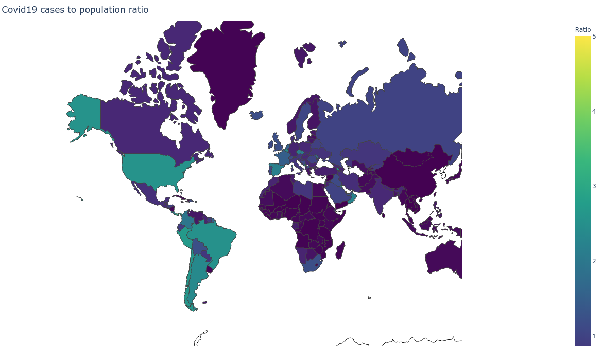
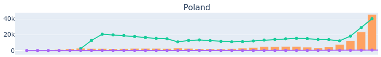

# COVID-19 data service

This code collects data on confirmed cases, deaths, tests, hospitalization rates, people quarantined, active and recovered (and more) from multiple sources. Includes methods of data analysis to produce meaningful trend graphs and meaningful comparisons between countries based on their population.

There are many websites already providing all this data. The purpose of this code is to provide complete flexibility in jupyter lab / notebook analysis for anyone with Python skills who want to check data for themselves

**World COVID-19 cases distribution**

**Poland hospital rate, deaths and new cases trends**


## Setup project

Create virtual environment

```bash
python3 -m venv venv
```

Activate venv and install dependencies

```bash
. ./venv/bin/activate
pip install -r requirements.txt
```

Run jupyter lab

```bash
jupyter lab
```

If you can't see charts in your jupyter notebook, you need to install the extension

```bash
jupyter labextension install jupyterlab-plotly
```

After a successful installation, restart the `jupyter lab` server

Note: you need Node.js, download and install it from here:

`https://nodejs.org/en/download/`

### (Optional) install and run telemetry backend

This code has **opentelemetry** tracing embeded to better observe and debug issues. This service is simple but makes a few data sourcing calls and then calls several data processing methods so is a good place to check opentelemetry-python implementation.

Please note: This is **optional** step for someone who wants to play around with opentelemetry and observe the functions being tracked.

* run Jaeger backend from docker

```bash
sudo docker run -p 16686:16686 -p 6831:6831/udp jaegertracing/all-in-one
```

* run Jaeger UI

`http://localhost:16686/`

* run `jupyther lab` then open `notebooks/World.ipynb` or `notebooks/Poland.ipynb` and go to above Jaeger UI to choose one from the following service:

`COVID-19-Poland-notebook`

or

`COVID-19-World-notebook`

* browse details in Jeager to see all operations, durations of processing and tags. If you don't see anything in the service selection box, run your notebook and refresh Jeager UI when finished.

## Data sources

* European Centre for Disease Prevention and Control (ECDC): https://www.ecdc.europa.eu/en
* COVID Tracking Project: https://covidtracking.com/data
* MZ_GOV_PL Twitter: https://twitter.com/MZ_GOV_PL
* wikipedia https://pl.wikipedia.org/wiki/Pandemia_COVID-19_w_Polsce#Statystyki

## Contributing

Read [how you can contribute](CONTRIBUTING.md)
